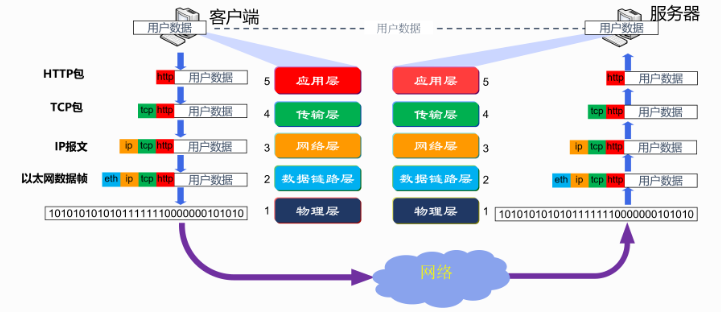

一套自底向上包含但不限于以太网协议、ARP、IP、ICMP、UDP、TCP、HTTP 七种协议的网络协议栈。该协议栈以 TCP/IP 协议模型为基础，划分为数据链路层、网络层、传输层和应用层四层结构。

在这个协议栈中，数据包会经历层层封装的过程，从上层逐步向下层传递。每一层都会为上层传来的数据包添加本层的包头信息，而下层的包头会在特定字段中指明其上一层封装的协议类型。需要强调的是，在封装过程中，原始的文件数据保持不变。

封装操作主要在发送方进行，它将数据从高层逐步向下层传递，每传递一层都会加上该层所需的包头信息。而拆封（还原操作）则发生在接收方，它按照协议栈的层次结构，逐层剥离包头，还原出原始的数据内容。

通过这样的封装和拆封过程，我们的协议栈能够确保数据在不同网络层次间正确、高效地传输，实现网络通信的目标。

